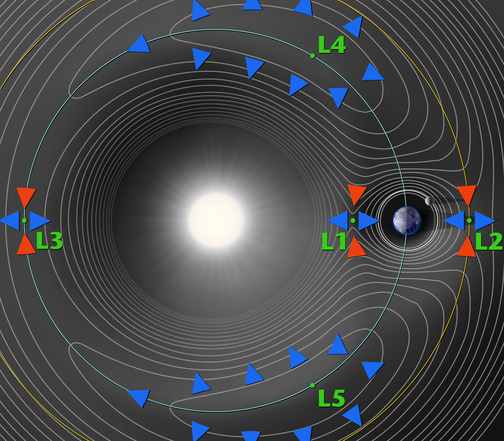

alias:: Lagrange Point

- https://www.wikiwand.com/en/Lagrange_point
- {:height 389, :width 375}
- 平面限制条件下的三体问题，存在的5个特解。
- 前三个由欧拉求得。
- https://solarsystem.nasa.gov/resources/754/what-is-a-lagrange-point/
- 